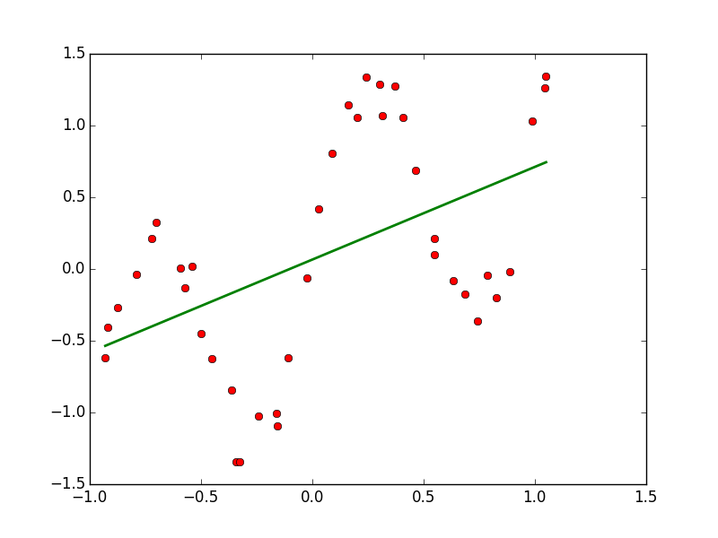
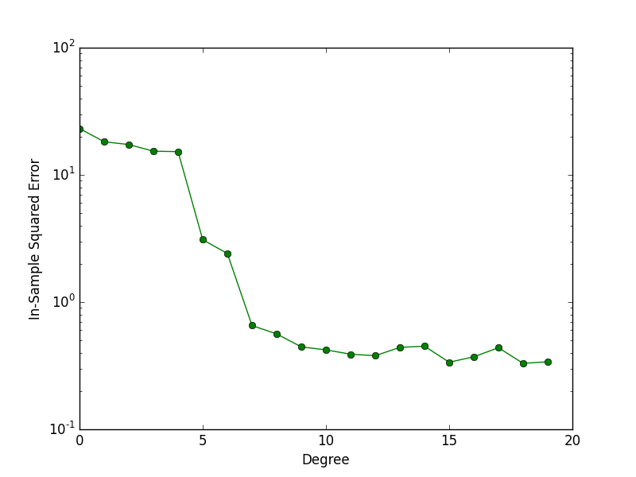
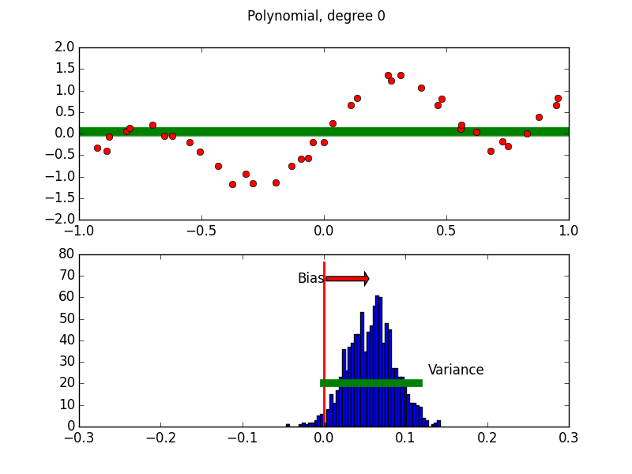
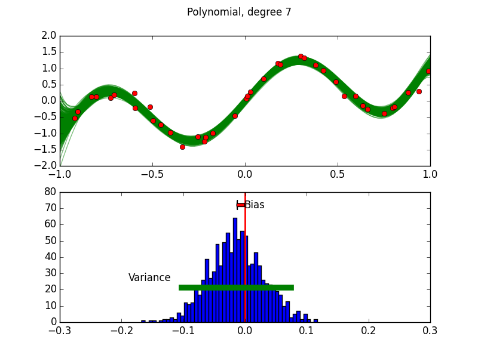
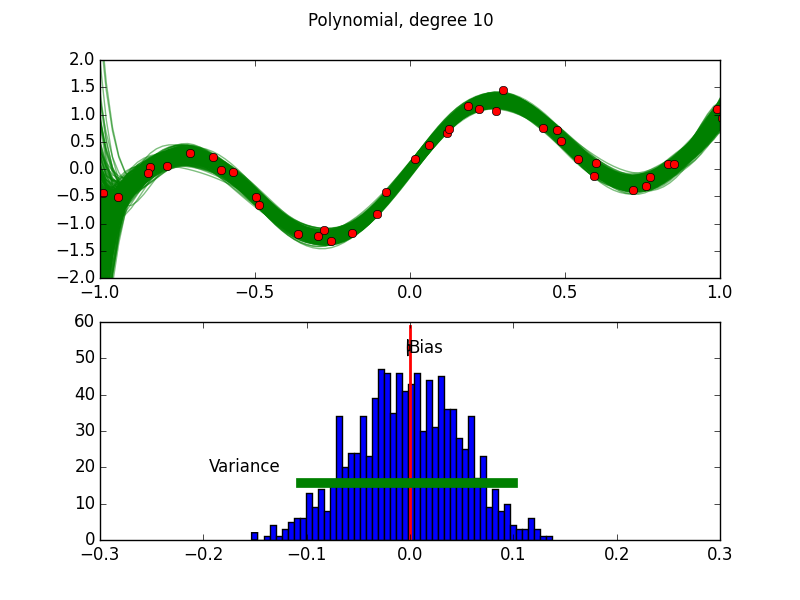
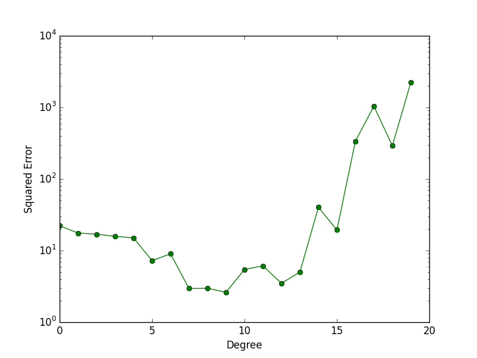
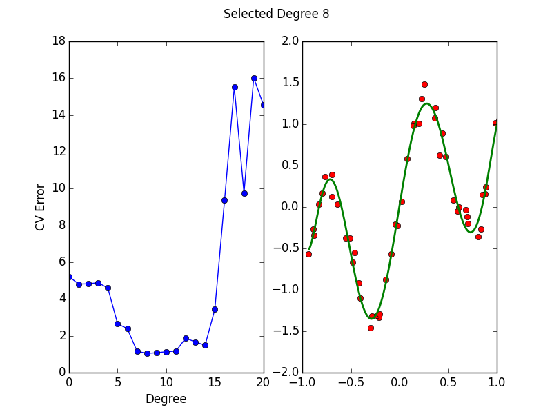
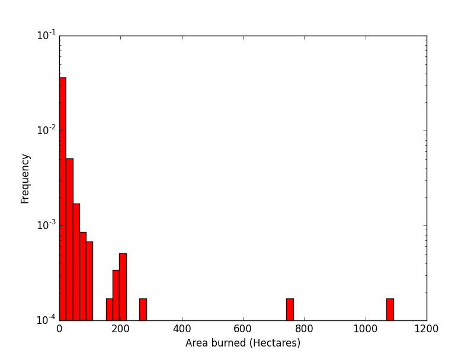

<style type="text/css">
.title-slide {
  background-color: #EDEDED; 
}
img {     
  max-width: 90%
}
</style>

<script type="text/javascript" src="http://ajax.aspnetcdn.com/ajax/jQuery/jquery-1.7.min.js"></script>
<script type="text/javascript">
$(function() {     
  $("p:has(img)").addClass('centered'); 
  });
</script>
 
## Purpose of This Course

You should leave here today:

* Having some basic familiarity with key terms,
* Having used a few standard fundamental methods, and have a grounding in the underlying theory,
* Having developed some familiarity with the python package `scikit-learn`
* Understanding some basic concepts with broad applicability.

We'll cover, and you'll use, most or all of the following methods:

|                |  Supervised   |  Unsupervised|
|---------------:|:--------------|:---------------|
|  CONTINUOUS    |  **Regression**:  OLS, Lowess, Lasso |   **Density Estimation**: Kernel Methods; **Variable Selection**: PCA |
|  DISCRETE      |  **Classification**:  Logistic Regression, kNN, Decision Trees, Naive Bayes, Random Forest |   **Clustering**: k-Means, Hierarchical Clustering |

--- &twocol

## Techniques, Concepts

... but more importantly, we'll look in some depth at these concepts:

*** =left

* Bias-Variance
* Resampling methods
    * Bootstrapping
    * Cross-Validation
    * Permutation tests

*** =right

* Model Selection
* Variable Selection
* Multiple Hypothesis Testing
* Geometric Methods
* Tree-based Methods
* Probabilistic methods

---

## ML and Scientific Data Analysis

Machine Learning is in some ways very similar to day-to-day scientific data analysis:

* Machine learning is model fitting.
* First, data has to be:
    * put into appropriate format for tools,
    * quickly summarized/visualized as sanity check ("data exploration"),
    * cleaned
* Then some model is fit and parameters extracted.
* Conclusions are drawn.

---

## ML vs Scientific Data Analysis

Many scientific problems being analyzed are already very well characterized.

* Model already defined, typically very solidily;
* Estimating a small number of parameters within that framework.

Machine learning is model fitting...

* But the model may be implicit,
* ... and disposable.
* The model exists to explore the data, or make improved predictions.
* Generally not holding out for some foundational insight into the fundamental nature of our world.

---

## Scientific Data Analysis with ML

But ML approaches can be very useful for science, particularly at the beginning of a research programme:

* Exploring data;
* Uncovering patterns;
* Testing models.

Having said that, there are some potential gotchas:

* Different approaches, techniques than common in scientific data analysis.  Takes some people-learning.
* When not just parameters but the model itself up for grabs, one has to take care not to lead oneself astray.
    * Getting "a good fit" is not in question when you have all possible models devised by human minds at your disposal.  But does it mean anything?

---

## Types of problems

Broadly, data analysis problems fall into two categories:

* **Supervised**: already have some data labelled with (approximately) the right answer.
    * *e.g.*, curve fitting
    * For prediction.  "Train" the model on known data, predict on new unlabelled data.
* **Unsupervised**: discover patterns in data.
    * What groups of items in this data are similar?  Different?
    * For exploration, evaluation, and prediction if useful.

---

## Types of Data

And we will be working on two broad classes of variables:

* **Continuous**: real numbers.
* **Discrete**: 
     * Categorical: Item falls into category A, category B...
     * Ordinal: Discrete, but has an intrinsic order.  (Low, Med, High; S, M, L, XL).

Others are possible too -- intervals, temporal or spatial continuous data -- but we won't be considering those here.

--- .segue .dark .nobackground

## Regression

---

## Regression

<<<<<<< HEAD
We're going to start discussing regression.

* It's the most familiar to most of us;
=======
We're going to spend this morning discussing regression.

* It's the most familiar to most of us; so
>>>>>>> master
* It's a good place to introduce some concepts we'll find useful through the rest of the day.

In regression problems, 

* Data comes in as a set of $n$ observations.
* Each of which has $p$ "features"; we'll be considering all-continuous input features, which isn't necessarily the case.
* And the initial data we have also has a known "endogenous" value, the $y$-value we're trying to fit.
* Goal is to learn a function $y = \hat{f}(x_1, x_2, \dots, x_p)$ for predicting new values.

---

## Ordinary Least Squares (OLS)

As we learned on our grandmothers knee, a good way to fit a functional
form $\hat{y} = \hat{f}(\vec{x};\theta)$ to some data $(\vec{x},y)$
is to minimize the squared error.  We assume the data is generated
by some true function

$$
y = f(\vec{x}) + \epsilon
$$

where $\epsilon$ is some irreducible error (here assumed constant), and we choose $\theta$:

$$
\hat{\theta} = \mathrm{argmin}_\theta \sum_i \left ( y_i - \hat{f} (x_i, \theta) \right )^2.
$$

---

## Note on Loss Functions

Here we're going to be using least squares error as the function
to minimize.  But this is not the only *loss* *function* one could
usefully optimize.

In particular, least-squares has a number of very nice mathematical
properties, but it puts a lot of weight on outliers.  If the residual
<<<<<<< HEAD
$r_i = y_i - \hat{y}_i$ and the loss function is $l = \sum_i \rho(r_i)$, some "robust regression" methods use different methods:
=======
$r_i = y_i - \hat{y}_i$ and the loss function is $l = \sum_i
\rho(r_i)$, some "robust regression" methods use different methods:
>>>>>>> master

$$ 
\begin{eqnarray*} 
\rho_\mathrm{LS}(r_i) & = &  r_i^2 \\
\rho_\mathrm{Huber}(r_i) & = & \left \{ \begin{array}{ll} r_i^2 & \mathrm{if } |r_i| \le c; \\ c(2 r_i - c) & \mathrm{if } |r_i| > c. \\ \end{array} \right . \\
\rho_\mathrm{Tukey}(r_i) & = & \left \{ \begin{array}{ll} r_i \left ( 1 - \frac{r_i}{c} \right )^2 & \mathrm{if } |r_i| \le c; \\ 0 & \mathrm{if } |r_i| > c. \\ \end{array} \right . \\
\end{eqnarray*} 
$$

---

## Note on Loss Functions

Even crazier loss functions are possible --- for your particular
application, it may be worse to over-predict than under-predict
(for instance), so the loss function needn't necessarily be symmetric
around $r_i = 0$.

The "right" loss function is problem-dependent.

For now, we'll just use least-squares, as it's familar and the
mechanics don't change with other loss functions.  However, different
algorithms may need to be used to use different loss functions;
many explicitly use the nice mathematical properties of least
squares.

---

## Polynomial Regression

Let's do some linear regression of a noisy, tilted sinusoid:


```python
import scripts.regression.biasvariance as bv
import numpy
import matplotlib.pylab as plt

x,y = bv.noisyData(npts=40)
p = numpy.polyfit(x, y, 1)
fitfun = numpy.poly1d(p)

plt.plot(x,y,'ro')
plt.plot(x,fitfun(x),'g-')
plt.show()
```

--- &twocol

## Polynomial Regression

*** =left

We should have something that looks like the figure on the right.

Questions we should be asking ourselves whenever we're doing something like this:

* How is this likely to perform on new data?
* How is the accuracy likely to be in the centre ($x = 0$)?  At $x = 2$?
* How robust is our prediction - how variable is it likely to be if we had gotten different data?

*** =right



--- &twocol

## Polynomial Regression

*** =left

Repeat the same steps with degree 20. 

We can get much better accuracy at our points if we use a higher-order polynomial.

Ask ourselves the same questions:

* How is this likely to perform on new data?
* How is the accuracy likely to be in the centre ($x = 0$)?  At $x = 2$?
* How robust is our prediction - how variable is it likely to be if we had gotten different data?

*** =right


--- &twocol

## Polynomial Regression - In Sample Error

*** =left

We can generate our fit and then calculate the error on the data we've used to train:

$$ 
E = \sum_i \left ( y_i - \hat{f}(x_i) \right )^2
$$

and if we plot the results, we'll see the error monotonically going down with the degree of polynomial we use.  So should we use high-order polynomials?

*** =right



---

## Bias-Variance Decomposition

Consider the squared error we get from fitting some regression model $\hat{f}(x)$ to some given set of data $x$:

$$
\begin{eqnarray*}
E \left [ (y-\hat{y})^2 \right ] & = & E \left [ ( f + \epsilon - \hat{f})^2 \right ] \\
              & = & E \left [ \left ( f - \hat{f} \right )^2 \right ] + \sigma_\epsilon^2 \\
              & = & E \left [ \left ( (f - E[\hat{f}]) - (\hat{f} - E[\hat{f]}) \right )^2 \right ] + \sigma_\epsilon^2 \\
              & = & E \left [ \left ( f - E[\hat{f}] \right )^2 \right ]  - 2 E \left [ ( f - E[\hat{f}]) (\hat{f} - E[\hat{f}]) \right ] + E \left [ \left (\hat{f} - E[\hat{f}]) \right )^2 \right ] + \sigma_\epsilon^2 \\
<<<<<<< HEAD
              & = & \left (f - E[\hat{f}]) \right )^2 + E \left [ \left ( \hat{f} - E[\hat{f}] \right )^2 \right ]  + \sigma_\epsilon^2 \\
              & = & \mathrm{Bias}^2 + \mathrm{Var}(f) + \sigma_\epsilon^2
=======
              & = & \left (E[f] - E[\hat{f}]) \right )^2 + E \left [ \left ( \hat{f} - E[\hat{f}] \right )^2 \right ]  + \sigma_\epsilon^2 \\
              & = & \mathrm{Bias}^2 + \mathrm{Var} + \sigma_\epsilon^2
>>>>>>> master
\end{eqnarray*}
$$

---

## Bias-Variance Decomposition

$$
<<<<<<< HEAD
\mathrm{MSE} = E \left [ \left (\hat{f} - E[\hat{f}]) \right )^2 \right ] + \left ( f - E[\hat{f}] \right )^2  + \sigma_\epsilon^2  =  \mathrm{Bias}^2 + \mathrm{Var}(f) + \sigma_\epsilon^2
=======
\mathrm{MSE} = \left (E[f] - E[\hat{f}]) \right )^2 + E \left [ \left ( \hat{f} - E[\hat{f}] \right )^2 \right ]  + \sigma_\epsilon^2  = \mathrm{Bias}^2 + \mathrm{Var} + \sigma_\epsilon^2
>>>>>>> master
$$

* Last term: intrinisic noise in the problem.  Can't do anything about it; we won't consider it any further right now.
* First term: **bias** squared of our estimate.
    * Is the expectation value of our regression estimate $\hat{f}$, the expectation value of $f$?
* Second term: **variance** of our estimate.
    * How robust/variable is our regression estimate, $\hat{f}$?

* Obvious: mean squared error has contribution from both of these terms.
* Less obvious: there is almost always a tradeoff between bias and variance.

--- &twocol

## Bias, Variance in Polynomial Fitting

*** =left

Because this is synthetic data, we can examine bias and variance in our regression estimates:

* Generate many sets of data from the model
* For each one,
    * Generate fit with given degree
    * Plot fit for visualization
    * Generate predictions at a given point (say, $x=0$)
* Examine bias, variance of predictions around zero.


*** =right


---

## Polynomial Fitting - Constant



---

## Polynomial Fitting - Linear


---

## Polynomial Fitting - Seventh Order



---

## Polynomial Fitting - Tenth Order



---

## Polynomial Fitting - Twentyth Order


---

## Bias and Consistency

Bias is a measure of how consistent the model is with the true behaviour.

Very generally, models that are too simple can't capture all of the
behaviour of the system, and so estimators based on these simple models
have higher bias.

As the complexity of model increases, bias tends to go down; the model
can capture whatever behaviour is seen.

---

## Variance and Generalization

Variance is a measure of how sensitive the estimated model is to the particular
set of data it sees.

It is very closely tied to the idea of **generalization**.  Is the model learning
trends that will generalize to a new set of data?  Or is it just overfitting the 
noise of this particular data set?

As the complexity of a model increases, it tends to have higher variance; simple
models typically have very low variance.

<<<<<<< HEAD
=======
Note too that variance typically gets smaller as sample sizes increase; a model
which shows large variance with different 100-point data sets will likely be
much better behaved on 1,000,000-point data sets.

>>>>>>> master
--- &twocol

## Bias-Variance Tradeoff

*** =left

For our polynomial example, if we compare the error in the computed
<<<<<<< HEAD
model with the "true" model (not generally availble to us!), we can
=======
model with the "true" model (not generally available to us!), we can
>>>>>>> master
plot the error vs the degree of the polynomial:

* For small degrees, the dominant term is bias; simpler models can't capture the true behaviour of the system.

* For larger degrees, the dominant term is variance; more complex models are generalizing poorly and overfitting noise.

There's some sweet spot where the two effects are comparably low.

*** =right



---

## Choosing the Right Model

(Or in this case, the "metaparameters" of the model)

<<<<<<< HEAD
In general, we get some dataset - we can't generate more data on a whim, and we certainly can't just compare to the true model.

=======
In general, we get some dataset - we can't generate more data on a
whim, and we certainly can't just compare to the true model.

So what do we do to choose our model?  If we simply fit with higher
order polynomials and calculate the error on the same data set,
we'll find that more complex models are always "better".

How do we do out-of-sample testing when we only have one set of samples?
>>>>>>> master

---

## Training vs Validation 

<<<<<<< HEAD
=======
The solution is to hold out some of the data.  The bulk of the data is used for training 
the model; the remainder is used for validating the trained model against "new" data. 

Once the model is chosen, then you train the selected model on the entire training+validiation
data set.

In some cases, you may need still further data; eg, you may need to both choose your
model, and end a paper or report with a sentence like "the final model achieved 80% accuracy...".
This still can't be done on the data the model was trained on (train+validation); in that case,
a second chunk of data must be held out, for testing. 

In the case of Training:Validation:Testing, a common breakdown of the data sizes might be 
50%:25%:25% of the initial set.  If you don't need a test data set, 2/3:1/3 is common.

Note that the data sets should be chosen randomly!

>>>>>>> master
---

## Hands-On: Model Selection 

Use this validation-hold-out approach to generate a noisy data set, and choose a degree polynomial to fit the 
entire data set.  The routines `numpy.random.shuffle()` and `numpy.split()` may be helpful.


```python
import scripts.regression.biasvariance as bv
x,y = bv.noisyData(npts=100)

import numpy
import numpy.random

a = numpy.arange(10)
numpy.random.shuffle(a)
print a
print numpy.split(a, 2)
```

```
## [7 3 9 5 4 8 2 1 0 6]
## [array([7, 3, 9, 5, 4]), array([8, 2, 1, 0, 6])]
```

---

<<<<<<< HEAD
## Cross Validation
=======
## $k$-fold Cross Validation

There are some downsides to the approach we've taken for validation hold-out.  What if most negative outliers happened to be in the training set?

Ideally, would do several partitions, average over results.

$k$-fold Cross Validation:

* Partition data set (randomly) into $k$ sets.
* For each set:
    * Train on the remaining $k-1$ sets
    * Validate on the held-out set
* Average results

Makes very efficient use of the data set, easily automated.

--- 

##  $k$-fold Cross Validation 

How to choose $k$?

* $k$ too large - the different training sets are very highly correlated (almost all of their points are the same).
* $k$ too small - don't get very much advantage of averaging.

In practice, 10 is a very commonly-used value for $k$.

--- 

##  $k$-fold Cross Validation 

Let's look at `scripts/regression/crossvalidation.py`:

```python
    err = 0.
    for i in range(kfolds):
        startv = n*i/kfolds; endv = n*(i+1)/kfolds
        test[idxes[startv:endv]] = True

        test_x  = x[test];  test_y  = y[test]
        train_x = x[-test]; train_y = y[-test]

        p = numpy.polyfit(train_x, train_y, d)
        fitf = numpy.poly1d(p)

        err = err + sum((test_y - fitf(test_x))**2)
        test[:] = False
```

--- &twocol

## $k$-fold Cross Validation

*** =left
Running gives:

```python
import scripts.regression.crossvalidation as cv
cv.chooseDegree(50)
```

This chooses the degree to fit 50 data points using
cross validation, and tests the results on a new 50 points.

The error is estimated for each degree, and the minimum is chosen.
In practice, may not want to greedily go for the minimum; the
simplest model that is "close enough" to the minimum is generally
a good choice.


*** =right
>>>>>>> master



---

## Resampling Aside #1 
### Bootstrapping

Cross-validation is closely related to a more fundamental method, bootstrapping. 

Let's say you want to find how some function of your data would behave - say, the range of sample means of your data, or
a mean and standard deviation of an estimation error for a given model (as with CV).

You'd like new sets of data that you could calculate your statistic on, and then look at the distribution of those.

---

## Parametric Bootstrapping

If you _know_ the form of the distribution that describes your data, you can simulate new data sets:

* Fit the distribution to the data;
* Generate synthetic data sets from the now-known distribution to your heart's content;
* Calculate the statistic on these synthetic data sets, and get their distribution.

This works perfectly well if you know a model that will correctly describe your data; and indeed if you do know that, 
it would be madness *not* to make use of it in your analysis.

But what if you don't?

---

## Non-parametric Bootstrapping

The key insight to the non-parametric bootstrap is that you already have an unbiased description of the process that generated your data - the data itself.

The apprach for the non-parametric bootstrap is:

* Generate synthetic data sets from the original by resampling;
* Calculate the statistic on these synthetic data sets, and get their distribution.

<<<<<<< HEAD
=======
This is less powerful than parametric bootstrapping **if** the parametric functional form is correctly known; but it is much better if the parametric
functional form is incorrectly known, or not known at all.

>>>>>>> master
Cross-validation is a particular case: CV takes $k$ (sub)samples of the original data set, applied a function (fit the data set to part, calculate error on the remainder), 
and calcluates the mean.  

Bootstrapping can be used far more generally.

---

## Non-parametric Bootstrapping

Example:

```python
import numpy
import numpy.random
numpy.random.seed(789)
data = numpy.random.randn(100)*2 + 1  # Normal with sigma=2, mu=1

print numpy.mean(data)
means = [ numpy.mean( numpy.random.choice(data,100) ) for i in xrange(1000) ]
print numpy.mean(means)
print numpy.var(means)   # expect: sigma^2/N = 4/100 = 0.04
```

```
## 1.03332758651
## 1.02269633225
## 0.0395873095222
```

--- 

## Hands On: Boostrapping Forest Fires

In the file `scripts/boostrap/forestfire.py` is a routine which will load historical data
about forest fires in northeastern Portugal, including the area burned.  You can view it
as follows:


```python
import matplotlib.pylab as plt
import scripts.bootstrap.forestfire as ff

t, h, w, r, area = ff.forestFireData(skipZeros=True)

n, bins, patches = plt.hist( area, 50, facecolor='red', normed=True, log=True )
plt.xlabel('Area burned (Hectares)')
plt.ylabel('Frequency')
plt.show()
```

<<<<<<< HEAD
```
## min burned Area =  0.09
```

=======
>>>>>>> master
--- 

## Hands On: Boostrapping Forest Fires



--- &twocol

## Hands On: Boostrapping Forest Fires

*** =left 
Using the non-parametric bootstrap, calculate the 5% and 95%
confidence intervals for the median of the area burned in forest
fires large enough to have their areas recorded.  Eg, you would
expect that in 90% of similar data sets, the median would fall
within those confidence intervals.

You should get a distribution of medians that look like the plot 
on the right:

*** =right


---

## Regression as Smoothing

<<<<<<< HEAD
=======
Regression is just a form of data smoothing - smoothing the data onto a particular functional form.

For instance, consider OLS linear regression on variables we've `centred' - subtracted off the mean.

The OLS regression function is
$$
\hat{y}(x) = \frac{\sum_i x_i y_i}{\sum_j x_j^2} x
$$
We can rewrite this as
$$
\hat{y}(x) = \sum_i y_i \left ( \frac{ x_i x}{\sum_j x_j^2} \right )
$$

That is, a weighted average of the initial $y_i$s.

>>>>>>> master
---

## Nonparametric Regression - LOWESS

<<<<<<< HEAD
=======


>>>>>>> master
---

## `statsmodels`

---

## Resampling Aside #2 
### Nonparametric Hypothesis Testing

Two-sample permutation test

--- .segue .dark .nobackground

## Classification

---

## Classification

Classification is a broad set of problems that supperficially look a lot like regression:

* Get some data in, with

---


## Confusion matrix

* Sensitivity v. Specificity
* Which are worse, false positives or false negatives? Depends!
* ROC curve

---

## Logistic Regression

---

## Closest labeled point

---

## Nearest Neighbours - $k$NN

---

## Naive Bayes

---

## Decision trees

--- .dark .segue .nobackground

## Variable Selection

---


## Try all combinations
http://xkcd.com/882/
* Be wary of multiple comparisons!
* Bonferroni, False Discovery Rate

---

## AIC, BIC, adjusted R^2

---

## PCA

---

## Lasso

--- .dark .segue .nobackground

## Clustering

--- 

## K-means

Foo bar baz

---

## Hierarchical Clustering

--- .dark .segue .nobackground

## Ensemble Methods

--- 

## Bagging, Boosting

--- 

## Random Forest
<<<<<<< HEAD
=======

---

## Useful Resources

* Cosma Shalizi, "Advanced Data Analysis from an Elementary Point of View", http://www.stat.cmu.edu/~cshalizi/ADAfaEPoV/, covers regression, hypothesis testing, PCA, and density estimation, amongst other things, and is extremely lucidly written.

>>>>>>> master
